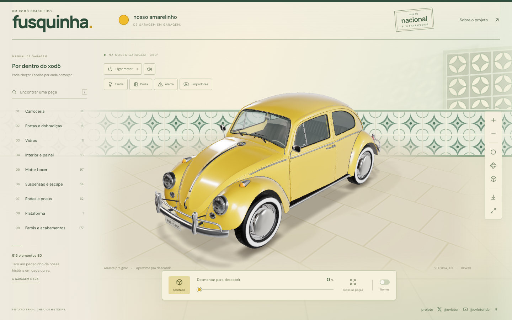

# Fusquinha

An interactive 3D yellow Volkswagen Beetle viewer. Explore the vehicle through orbit and zoom controls, assembly and part selection, isolation, wireframe, PNG capture, and a progressive disassembly of 515 elements.

**[Open Fusquinha online](https://victorsodre.github.io/fusquinha/)**

Concept and direction by **Victor** — [@ovictor on X](https://x.com/ovictor) and [@ovictorlab on YouTube](https://www.youtube.com/@ovictorlab).

The interface defaults to English and includes a Brazilian Portuguese option. The scene is an independent React, TypeScript, and Three.js implementation inspired by [Ashe’s Model X Studio](https://github.com/ashemag/model-x-studio). No code or assets from that project were copied.



## Run locally

Node.js 22.13+ and npm are required.

```sh
npm ci
npm run dev -- --port 3016
```

Open http://127.0.0.1:3016.

The repository and deployment include code, GLB, sound, lighting, and scenery by Victor’s express decision. Third-party assets keep their own licenses; inclusion here does not place them in the public domain. Read the [asset provenance and terms](docs/ASSETS.md).

## Controls

- Drag to rotate; use the mouse wheel or pinch to zoom.
- Start engine plays the supplied engine recording in a loop and adds subtle body vibration. Mute silences engine and effects without stopping the vehicle state.
- Headlights, driver door, hazard lights, and wipers have synchronized visual and audio behavior.
- Select an assembly from the catalog or click a part on the vehicle. Use the part picker and **Isolate** for closer inspection.
- The **Disassemble** control moves from the assembled vehicle to separated assemblies and then to a complete 100% layout.
- `E` toggles assembly/disassembly, `R` resets the camera, `/` opens search, and `Esc` closes panels and exits isolation.

The engine starts off. The original OGG recording is supplied with an MP3 compatibility version. Vibration is disabled when reduced motion is requested.

Engine sound: **Dušan Oblak / Work With Sounds / Technical Museum of Slovenia**, a 1984 Beetle 1600 recording under [CC BY 4.0](https://creativecommons.org/licenses/by/4.0/). [Source on Wikimedia Commons](https://commons.wikimedia.org/wiki/File:WWS_VolkswagenBeetle8211engine.ogg). Victor selected the recording; it is uncut, MP3-converted, looped, and adjusted for playback volume.

## Verification

```sh
npm test
npm run build
```

The geometry tests verify identities, finite positions, separation of every part, and camera coverage in three aspect ratios. Browser interaction records are written to `output/playwright/` when Playwright checks are run.

Pull requests and pushes also run [judg3d](https://github.com/victorsodre/judg3d) on `public/models/fusca.glb` via [`.github/workflows/judg3d-gate.yml`](.github/workflows/judg3d-gate.yml). The gate uses the bundled `web-commerce` profile (SCHEMA / glTF validation only) and pins the published CLI to `judg3d@0.1.0`. Bump that version input when `0.2.0` (or later) is published and you have checked the changelog. To add triangle, material, or texture budgets later, copy a profile into `.judg3d/` and point the workflow at that file; do not treat `agent-loop` sample numbers as defaults for this model.

## GitHub Pages publication

GitHub Pages serves the production build from `gh-pages`; `main` contains source. Relative paths allow the model, audio, and lighting to load at `/fusquinha/`.

```sh
npm test
npm run build
python3 scripts/prepare-pages.py
git push origin main gh-pages
```

The publication script prepares only the publication branch and preserves the current checkout. `release.json` identifies the source commit used for the build.

## Model pipeline

```sh
python3 scripts/download-source.py
blender --background --factory-startup --disable-autoexec --threads 2 --python scripts/prepare-model.py
blender --background --factory-startup --disable-autoexec --threads 2 --python scripts/export-model.py
```

The pipeline keeps the source `.blend` in `/private/tmp/fusca-source.blend`, separates its islands, and exports `public/models/fusca.glb` with its manifest. Embedded asset scripts remain disabled. The project is an educational visual exploration: its artistic islands are not an OEM catalog or manufacturing documentation, and the Brazilian reinterpretation does not claim complete historical fidelity to any national year or model.

## Sound effects

The six prepared command-effect excerpts are included. To recreate them from the four supplied MP3 files:

```sh
python3 scripts/prepare-sounds.py /path/to/fusquinha-sfx
```

See [sound sources, credits, and edit timings](docs/SOUND-SOURCES.md).
